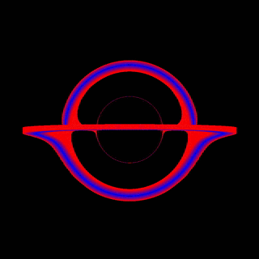

# GeodesicIntegrator

A simple code to calculate geodesics using a given space-time using MPI to
accelerate. It can just create geodesic traces or render pictures of simple 
geometries positioned in space-time. ( See example below ) 



## Getting Started 

To run the example to calculate Null-geodesics around a schwarzschild Black Hole  

```
$ Examples/0_SimpleGeodesicBlackHole
$ make && ./main
$ python plot.py
```


## Technologies

Here we use 

* GNU Make 
* C++ with version 14 or higher 
** MPI 
** GSL 
* ImageMagick 
* python 2.7 or higher 


# 


